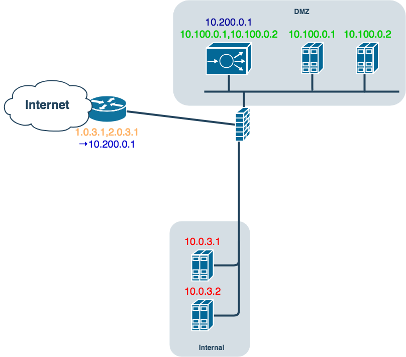

# Simple OSS DB experiment with Neo4J

## Disclaimer

This is a simple experiment. It was tested only on PowerShell core on Mac OS X. Feedback welcome but use at your own risks.

## Case Study 1



## Usage

Change the password in ./Connect.ps1


Run the following command to completely cleanup your database and reload all CSV files:

    Invoke-Build -File ./OSSDb.build.ps1

You can then experiment various queries from ```query.cypher``` in the neo4j
web interface.

## Setup

### Install the Neo4j DotNet driver
    nuget install Neo4j.Driver -OutputDirectory ./nuget/

### Install Invoke Build

    Install-Module InvokeBuild
